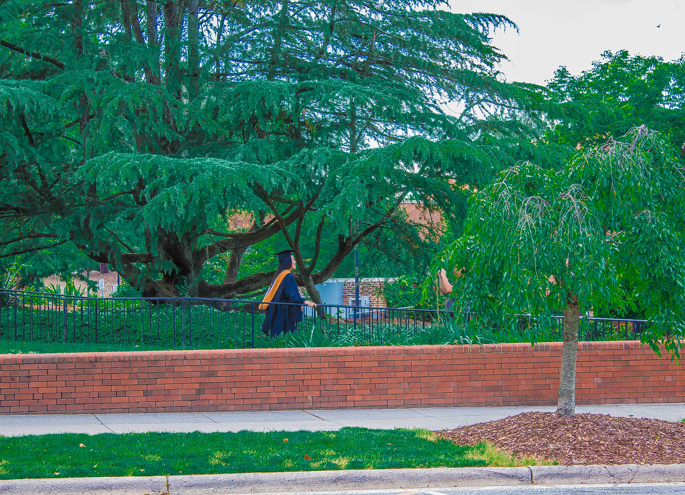
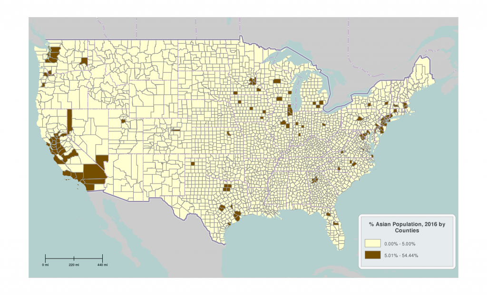

# Rhizome Ethnographies

tags: ethnography, politics, social, narrative, ontology, p2p, diversity, heterogeneity, identity, self, articles

**Date:** 2016 - 2018

## Starting point

### A new research

After several years exploring, from a computational perspective, the evolution of social complexity in heterogeneous and decentralized agent-based models [1, 2], I have decided to start a new stage of research. With this side project, I would like to study the evolution of identity/identities in real social agents. Specifically exploring heterogeneous societies through the observation of their ethnic, linguistic and cultural contexts, and using visual ethnography to learn about transnational identities and multiculturalism.

So let’s say that I am moving from the fields of Computer Science and Information Science to a new multidisciplinary approach closer to the domains of Sociology and Cultural Anthropology. From software simulations of artificial agents to multicultural communities of actual people.

So far, most of my research has been based in quantitative approaches, predominantly in-silico modeling of bacteria colonies and artificial societies [3]. I have been studying the evolution of artificial societies with Artificial Intelligence techniques, with the goal of finding answers to Information Science questions [4]. In fact, most of my former research was oriented, under the umbrella of the Complex Adaptive Systems paradigm (CAS), to understand the role of decentralization and heterogeneity in the emergence of social complexity in innovative scenarios [5, 6].  Regarding the application of my research to Social Sciences, you can tell that most of it was mainly grounded on computational and mathematical models. Fortunately, that lack of actual data can be addressed by radically changing my approach.

During my graduate studies, I coined (and re-coined) a couple of terms (such as “P2P Society” or “P2P Paradigm”) trying to understand the social dynamics of a globalized and plural world. A world with fully decentralized communication networks (see distributed topology [6]) and collaborative communities of heterogeneous peers. I also did some side research on distributed technologies such as different blockchain-based projects to frame the P2P society in that growing ecosystem of emancipatory tools and methods. The Bitmind project [7] was one of those initiatives.

I had the chance to exchange knowledge with several scholars from different fields, trying to do multidisciplinary research. But I was always constrained by the limits of my own field and its methodologies. So even though I will continue publishing and doing research in my own field, I would like to explore in parallel a different experience.

In my thesis and the published papers, posters and communications, I always try to be faithful and accurate, and to keep my research as much constrained as possible in order to offer reliable results according to the scientific method. However, sometimes I feel that to explore social issues properly I need something else, something more than just a quantitative and hypothetical-deductive approach. So I decided that it was the time for a new kind of experience, an open-ended side project, a new kind of both personal and academic approach to reality. Less closed and constrained, less machine-ish and more human-ish.

Although I had a great time observing the evolution of different social dynamics with a computationally-based approach, I realized that I wanted to know more about the human being as a social construct. And I wanted to know it from my own subjective point of view, the point of view of another social construct.

Considering the term ‘agent’ as the most convenient to refer to free individuals endowed with reason and autonomy, I can say that this time I am focused in the observation of the agent itself, a common individual within a physical and social environment. And I am doing it with a completely different toolbox. I want to conduct this research with my own ontological and epistemological constraints, but without the ones imposed by an specific academic field. Understand the inner nature of the social agent, and maybe study again the functional and structural evolution of the social object (the social network of agents). But obviously, with a very different approach. This approach shall be less deterministic, objective, quantitative and pretentious, while focusing on the live experience rather than on the expected results. I will accomplish this by going to the arena and getting immersed rather than implementing a synthetic in-silico arena and observing it through a screen, doing visual ethnography and taking field notes rather than coding simulations and analyzing results. If you are more interested in the other perspective, you can check my peer-reviewed publications and follow my other projects.

One of the first steps to make this change happen is to avoid a hypothetical-deductive mindset and assume a more inductive approach, without preconceived axioms, without a priori hypotheses or pretentious irrefutable truths. In order to do that I have to go beyond my academic background, unlearn and relearn again, and start the new stage without self-constraints. With a methodology (or a set of methodologies) but without a fixed and self-constraining outline.

Computational social modeling requires a reduced amount of variables in isolation and a considerable lack of sociological, anthropological, historical or psychological background. Ethnographical research, however, requires a very different mindset. It may imply critical thinking, personal immersion and opened eyes in the seeking of facts, qualitative data and other kinds of knowledge.

Furthermore, self-conducted research can also be phenomenological. And in addition to that, it may imply a bunch of other things. It can be a rhizome of field notes, secondary data, memories and media resources. It can be a mesh of interconnected experiences.

Considering this new stage as a chosen path for knowledge crawling, I would consider it both research, game and art. Besides that, naturally, I would also consider this project a way of self-exploration.

What defines the self besides the constraints of national boundaries, ethnicity, race, religion and culture? Are we just a consequence of our context and history? Would it be possible to understand better the complexity of individual and group identities combining photography and film-making as visual ethnography tools with other traditional methods? Could we generalize what we learn from a small sample of people to understand better the notions of ethnicity, race and cultural identity? What can we discover about the object of study with a phenomenological perspective?

This research follows an ethnographical approach and eventually may use some traditional methods, such as participant and direct observation [8] or unstructured interviewing, in order to look for possible answers to the above-mentioned questions. However, it is mainly a visual ethnography and it uses photography and film-making as visual languages. It is also a phenomenological research. It is also a live experience without hypotheses and pre-conceived axioms.

It is a happy lack of expectation.

### References

[1] J. R. Hernandez-Carrion and D. González-Rodriguez, “Modelling Complex Dynamics and Distributed Generation of Knowledge with Bacterial-Based Algorithms,” Scientific Publications / University of Economics in Katowice, vol. Economics and Business Communication Challenges : International Week, pp. 138–148, 2014.

[2] Gonzalez-Rodriguez, Diego and Hernandez-Carrion, Jose Rodolfo, “Decentralization and heterogeneity in complex adaptive systems,” Kybernetes, vol. 44, no. 6/7, pp. 1082–1093, Jun. 2015.

[3] D. González Rodríguez, “Modelización de Sistemas de Computación Distribuida con Bacterias Sintéticas mediante Autómatas Celulares,” 2014.

[4] D. Gonzalez-Rodriguez and J. R. Hernandez-Carrion, “Fundamentos teóricos básicos para la defensa de un paradigma P2P cooperativo desde la perspectiva de la producción de conocimiento,” Revista Iberoamericana de Autogestión y Acción Comunal (RIDAA), vol. 0, no. 66, pp. pp. 55–66, 2015.

[5] D. Gonzalez-Rodriguez and J. R. Hernandez-Carrion, “A Bacterial-Based Algorithm to Simulate Complex Adaptive Systems,” in From Animals to Animats 13, A. P. del Pobil, E. Chinellato, E. Martinez-Martin, J. Hallam, E. Cervera, and A. Morales, Eds. Springer International Publishing, 2014, pp. 250–259.

[6] D. Gonzalez-Rodriguez and V. Kostakis, “Information literacy and peer-to-peer infrastructures: An autopoietic perspective,” Telematics and Informatics, vol. 32, no. 4, pp. 586–593, Nov. 2015.

[7] Gonzalez-Rodriguez, Diego and Shapiro, Ishan, “Scalable cognition through collaborative sense-making: drafting the Open Value Network model,” presented at the Workshop on Synthetic Cognitive Development and Integrated-Distributed Agency (IDA). The Eighth Conference on Artificial General Intelligence, Berlin, 2015.

[8]B. B. Kawulich, “Participant Observation as a Data Collection Method,” Forum Qualitative Sozialforschung / Forum: Qualitative Social Research, vol. 6, no. 2, May 2005.

## Context

### Social Context

In order to easily address the social context of the studied object, many photographic explorations will be contextualized with some secondary data.

Before exploring the notion of identity in a multicultural environment using visual ethnography tools, I would like to remark the importance of one single question: can we really consider that the context in which we are going to start this study is a heterogeneous society?

Most of the initial field research will take place in the city of Greensboro (North Carolina), a city with enough racial and ethnical diversity [1] to be considered a multicultural environment (see Table 1 and Table 2). Because of that, we can remark that it is a place that can provide enough resources to study the previously mentioned issues [2].

**Table 1. Race**

|  Subject | Number  |  Percent |
|---|---|---|
|Total population|269,666|100.0|
|A. One race |	262,586 |	97.4|
|A.1. White |	130,396 |	48.4|
|A.2. Black or African American 	|109,586 |	40.6|
|A.3. American Indian and Alaska Native |	1,385 |	0.5|
|A.4 Asian |	10,772 |	4.0|
|A.5. Native Hawaiian and Other Pacific Islander |	157 |	0.1|
|A.6. Some Other Race |	10,290 |	3.8|
|B. Two or More Races |	7,080 |	2.6|
|B.1. Two races with Some Other Race |	1,353 |	0.5|
|B.2. Two races without Some Other Race |	4,972 |	1.8|
|B.3. Three or more races with Some Other Race | 133 |	0.0|

**Table 2. Hispanic or Latino**

|  Subject | Number  |  Percent |
|---|---|---|
|Total population |	269,666 |	100.0|
|A.Hispanic or Latino (of any race) |	20,336 |	7.5|
|A.1 Mexican |	12,293 |	4.6|
|A.2. Puerto Rican |	1,872 |	0.7|
|A.3. Cuban |	520 |	0.2|
|A.4. Other Hispanic or Latino |	5,651 |	2.1|
|B.Not Hispanic or Latino |	249,330 |	92.5|

### Observer context

Moreover, it is crucial to consider that this project, whereas it follows an ethnographic approach, it is intrinsically interwoven with the author’s background and subjective biases, preferences and perceptions. So I would not pretend to isolate my self from this research, but rather to take advantage of my position as an active agent in the process. Something more than just a participant observer [3].

Then I shall consider that my personal views and cognitive biases are an important part of the context on this project. Indeed, this is also a personal self-ethnography, or autoethnography [4, 5, 6], an introspective and reflexive experience. So rather than just relying on sociological data, I will offer a personal point of view, literally. I will use my photographic field work as my main source of data and as a tool for reflection.  I also may provide notes to understand phenomenologically my personal process of adaptation as an agent, as a self-organizing system with consciousness and adaptive behavior -for more information about the common points of Cognitive Science, Complex Adaptive Systems and Social Agents you can read the third chapter of my doctoral thesis [7]-.

Phenomenology can be a complementary approach to explore deeply something as amazing as a real intercultural experience. That is, explore my own identity formation, my own process of acculturation and self-reflection. According to the Stanford Encyclopedia of Philosophy [8]:

>   “phenomenology” is often restricted to the characterization of sensory qualities of seeing, hearing, etc.: what it is like to have sensations of various kinds. However, our experience is normally much richer in content than mere sensation. Accordingly, in the phenomenological tradition, phenomenology is given a much wider range, addressing the meaning things have in our experience, notably, the significance of objects, events, tools, the flow of time, the self, and others, as these things arise and are experienced in our “life-world”. […]

 >   Basically, phenomenology studies the structure of various types of experience ranging from perception, thought, memory, imagination, emotion, desire, and volition to bodily awareness, embodied action, and social activity, including linguistic activity.

According to this statement, phenomenological research may involve the subjective experience of the author. In the case of this project, the research process itself is an open reflection regarding my personal path, the point of view of an outsider in a new land who tries to learn about the aforementioned issues, studying and adapting through face-to-face exchanges. We can talk about a living research conducted by an agent who is living immersed in a multicultural environment, using a foreign language, learning new habits and social rules.

Besides that, phenomenology can also be a philosophical perspective to interpret reality through the eyes of other individuals.  It may be considered an invitation to empathize with other peers and learn about their subjective perceptions, a way to understand the real world without considering objectivity as a requirement. According to Trochim [9]:

 Phenomenology is a school of thought that emphasizes a focus on people’s subjective experiences and interpretations of the world. That is, the phenomenologist wants to understand how the world appears to others.

### Methods

I seldom exposed a personal opinion in my peer-reviewed papers. I will totally express myself in a different way in this space though.

So, in order to feel completely free during the course of this project, I shall remark that my personal engagement with this research does not imply any fixed preference for a specific research method or criteria. As it has been said before [2], this project will follow both an ethnographic and phenomenological approach, without the methodological and analytical constraints of my former research. It will be usually guided by a non-linear process of bibliographic research, field work and photographic processing, in conjunction with a learning period guided by peer-to-peer interactions, reading and self-reflection.

I will assume as a theoretical framework most of what was already contextualized in the antecedents and the theoretical chapters of my doctoral dissertation [7], in conjunction with some theses from social constructivism and multiculturalism.

Basically, I will explore different methods through the process. This freedom will enable me to explore the experience with creativity and openness. Therefore, the evolution of this research will be guided by my interaction with the social and physical environment, sometimes directly and sometimes through the lenses of my camera.

Considering the individual as a product of the social environment in which it is immersed, and assuming the personal point of view of the observer, I would like to apply visual ethnography tools [10, 11] and data visualization technologies. So don’t be surprised if some of the sections of this live document have more pictures, videos, maps or graphs than words. The idea is to display both raw data and context-dependent information visually. The idea is to offer a visual ethnography within a hypermedia platform.

Just try to read behind the scenes and draw your own conclusion.

### References

[1] U.S. Census Bureau, “Census United States 2010; QT-P3 - Race and Hispanic or Latino Origin: 2010; generated by Diego Gonzalez-Rodriguez using American FactFinder;,” 2010. [Online]. Available: http://factfinder.census.gov. [Accessed: 14-Apr-2016].

[2] D. Gonzalez-Rodriguez, “Starting point,” Rhizome Ethnographies, 14-Apr-2016. [Online]. Available: http://wiki.xmunch.com. [Accessed: 18-Apr-2016].

[3] B. Tedlock, “From Participant Observation to the Observation of Participation: The Emergence of Narrative Ethnography,” Journal of Anthropological Research, vol. 47, no. 1, pp. 69–94, 1991.

[4] F. W. Ngunjiri, K.-A. C. Hernandez, and H. Chang, “Living Autoethnography: Connecting Life and Research,” Journal of Research Practice, vol. 6, no. 1, p. 1, Aug. 2010.

[5] C. Ellis, T. E. Adams, and A. P. Bochner, “Autoethnography: An Overview,” Historical Social Research / Historische Sozialforschung, vol. 36, no. 4 (138), pp. 273–290, 2011.

[6] C. N. Poulos, “Spirited Accidents: An Autoethnography of Possibility,” Qualitative Inquiry, Nov. 2009.

[7] D. González Rodríguez, La descentralización estructural y la heterogeneidad funcional en la producción colectiva de conocimiento: una justificación teórica y computacional del paradigma P2P. Getafe: Universidad Carlos III de Madrid, 2015.

[8] D. W. Smith, “Phenomenology,” in The Stanford Encyclopedia of Philosophy, Winter 2013., E. N. Zalta, Ed. 2013.

[9] William M.K. Trochim, “Qualitative Approaches: Phenomenology,” Social Research Methods., 2006. [Online]. Available: http://www.socialresearchmethods.net/kb/qualapp.php. [Accessed: 20-Apr-2016].

[10] D. Schwartz, “Visual ethnography: Using photography in qualitative research,” Qual Sociol, vol. 12, no. 2, pp. 119–154, Jun. 1989.

[11] S. Pink, Doing Visual Ethnography. SAGE, 2013.

## Downtown Greensboro

### History

Downtown Greensboro is known as the spot in which one of the most successful actions of the Civil Rights Movement took place [1]. According to Andrews and Biggs [2],  Greensboro was not the first city which had a sit-in (there were some similar actions in the 1940s and the 1950s). However, in 1960 an unexpected wave of sit-ins started at the core of Downtown Greensboro:

> On February 1, four freshmen from North Carolina Agricultural and Technical (A&T) College in Greensboro occupied the lunch counter of Woolworth’s after being refused service. The protest was repeated, with increasing numbers of students, on the following days […] The sit-ins in Greensboro inspired blacks in other cities to adopt this form of protest. After a week, sit-ins began elsewhere in North Carolina; soon the wave of protest surged into other states [2].

Andrews and Biggs’s paper explores how, after that specific action in the core of Downtown Greensboro, the wave expanded through almost all the Southern states in about two months. Figure 1 displays how several cities in the South joined the protest [2]:

**Figure 1.** *Sit-Ins in the South from February to April 1960.*

We can consider Downtown Greensboro an important object of observation, the core of the Historic District of the city, the node in which an extraordinary social movement started. One physical space strongly related with the fight for intercultural values in a country which was racially segregated by law only some decades ago.

### Visualizing the map of segregation

In order to understand the multicultural reality of this city, it is crucial to take a look at the geographical distribution of Greensboro regarding race. Rather than analyzing the data provided in the Census 2010 [3], I have chosen a more intuitive way to visualize it.  To create the following images I have used the visualization tool CensusViewer [4]. The red color represents areas with a larger white population. The green represents areas with a larger black population. The other colors represent other racial groups.

The three following images (Fig. 1, 3 and 4) display different zoom levels of the city of Greensboro.

**Figure 2.** *Visualizing segregation 1*

**Figure 3.** *Visualizing segregation 2*

**Figure 4.** *Visualizing segregation 3*

If we analyze this visual data, we can understand better the multicultural nature of this city. We can also realize that segregation is not just something which existed in the past.

If we observe the spatial distribution of the different neighborhoods of the city, we can not talk about real integration. Furthermore, this snapshot can show more useful information. Can we speculate and suspect that those train rails someday constituted a physical boundary between two worlds? Are there still two different worlds with different historical identities?

Figure 4 is specially interesting. We can see that just there, in the middle of those homogeneous realities, a neutral space talks about understanding and intercultural exchange. About unity. About mixture.

Just there, it is Downtown.

 *NOTE*: These are just thumbnails. To see the big pictures you can check [Flickr](https://www.flickr.com/photos/xmunch/26044956193/in/photolist-Jv7Ssw-JLJTPj-JLJTZj-HZzaX2-FFiWK5-GyuzQd-GbFNb9-GARrKv-GbFHsm-FFiK9j-FFiMxs-FFvkA2-FFvpfg-GARkhk-FFiGXq-FFiJeU-GsB5QY-GARgGe-FFvgv8-GARa7R-FFvd5R-GsAYqd-Gv3kNF-GsAT5U-GsAVZG-FFiuRb-FFv1Vg-GyudfE-GbFhVf-GbFhdo-FFipAb-Gv3KzD-Gv3dqz/)

 ### References

[1] A. Morris, “Black Southern Student Sit-in Movement: An Analysis of Internal Organization,” American Sociological Review, vol. 46, no. 6, pp. 744–767, 1981.

[2] K. T. Andrews and M. Biggs, “The Dynamics of Protest Diffusion: Movement Organizations, Social Networks, and News Media in the 1960 Sit-Ins,” American Sociological Review, vol. 71, no. 5, pp. 752–777, Oct. 2006.

[3] U.S. Census Bureau, “Census United States 2010; QT-P3 - Race and Hispanic or Latino Origin: 2010; generated by Diego Gonzalez-Rodriguez using American FactFinder;,” 2010. [Online]. Available: http://factfinder.census.gov. [Accessed: 14-Apr-2016].

[4] “CensusViewer,” 2015. [Online]. Available: http://censusviewer.com/. [Accessed: 20-Apr-2016].

## Visualizing Integration with photography

### Context

Previously we have described the city of Greensboro as a place with enough racial and ethnic diversity to be considered a multicultural environment. Furthermore, part of the agents observed in this research are students of the University of North Carolina at Greensboro (UNCG).

According to the data provided by CollegeData and CollegePortraits  [1, 2], UNCG is a public university with 15,173 undergraduate students -9,957 (65.6%) women and 5,216 (34.4%) men- and 3,474 graduate students with a remarkable ethnic diversity (see Table 1). Besides that, 2.8% of UNCG students are international students from 55 different countries worldwide.

**Table 1.** *Ethnicity of Students from U.S.* 

|  Percentage | Ethnicity  |
 |0.1  |	Native Hawaiian/ Pacific Islander |
 |0.4  |	American Indian/Alaskan Native |
 |1.4  |	Unknown |
 |4.2  |	Multi-race (not Hispanic/Latino) |
 |4.6  |	Asian |
 |6.8  |	Hispanic/Latino |
 |27.5  |	Black/African-American |
 |55.0  |	White |

 ### Photographic Exploration

 Our visual ethnography continues in the University of North Carolina at Greensboro. Like Downtown, UNCG is not black or white. It is a multicultural environment, a place for intercultural exchange and heterogeneity.

### References

[1] CollegeData, “University of North Carolina at Greensboro Students - CollegeData College Profile,” 2015. [Online]. Available: http://www.collegedata.com/cs/data/college/college_pg06_tmpl.jhtml?schoolId=1602. [Accessed: 15-Apr-2016].

[2] College Portrait, “College Portraits (2015); University of North Carolina at Greensboro; Fall 2015.,” 2015. [Online]. Available: http://www.collegeportraits.org/NC/UNCG/characteristics. [Accessed: 15-Apr-2016].

## Visualizing Integration with Hypermedia

### Hypermedia: American Random Walks

**Rhizome Ethnographies** is a *hypermedia article*.

In order to display some of the results of this research in a more interactive way, I have published a live story-map named American Random Walks that allows the reader to interact with the data: http://arcg.is/2ewJLcA.

> **American Random Walks** is a responsive webapp which adapts to smartphones and tablets, but I would recommend the reader to explore it from a bigger device, such as a laptop or a computer with a large screen. [[Click here to open the webapp](http://arcg.is/2ewJLcA)]

Bellow, I also provide some maps and other data visualization examples to understand better the current distribution of population in the US and its multicultural nature.

### A heterogeneous map

Additionally to the interactive maps provided in the American Random Walks webapp, the images which are provided bellow can be useful representations to visualize the distribution of population, by counties, in the Contiguous United States (Alaska, Hawaii and other American territories are not represented).

#### Black population

#### Hispanic population

#### White population

#### American Indian and Alaska Native population

#### Asian population

### Empty zones and minorities

Even though we can talk about a heterogeneous map, we find counties in which minorities are less represented than in others. Specifically, the next four maps show the “empty zones”, areas with less than 5% of the population represent a specific population group.

But beyond visual information displayed on maps and photos, there is another way to visualize segregation and integration, there is another way to explore multiculturalism far beyond the limits of static representations. Film-making will be explored in the next section as a tool to provide human testimonies to our visual ethnography.

## Visualizing Integration with Video

In this section I display some video material to face from another perspective the questions of this project. Film-making offers a dynamic experience for visual ethnography, and lets us address the same issues but based on testimonies rather than static representations.

After some photographic and infographic exploration of multiculturalism in the U.S.  with the **Rhizome Ethnographies** project, I decided to use a film-making approach as a qualitative method for this research.  The result is named **“Looking for identity: What does it mean to be an American?”.**

This movie is a conversation about the American identity from a multicultural point of view. 

Some controversial issues are exposed, presenting a nation with a heterogeneous society, a complex and evolving multi-ethnic identity and a conflict of cultural forces and discourses.

In the moment of historic change in which this has been filmed (2016-2017), the U.S.A. faces a moment of transformation and tensions between a national identity and a large number of racial, ethnic, religious or linguistic identities, between assimilation and intercultural engagement.

<iframe src="https://www.youtube.com/embed/1rUHNIJ7rn0" allowfullscreen="allowfullscreen" width="100%" height="315" frameborder="0"></iframe>

**“Looking for Identity”** was initially thought as a set of documentaries which would expose the wide diversity of perspectives defining people’s identities in the United States of America. I finally only released the first part. 

Hopefully in the future I will have time and resources to finish the project though :)

