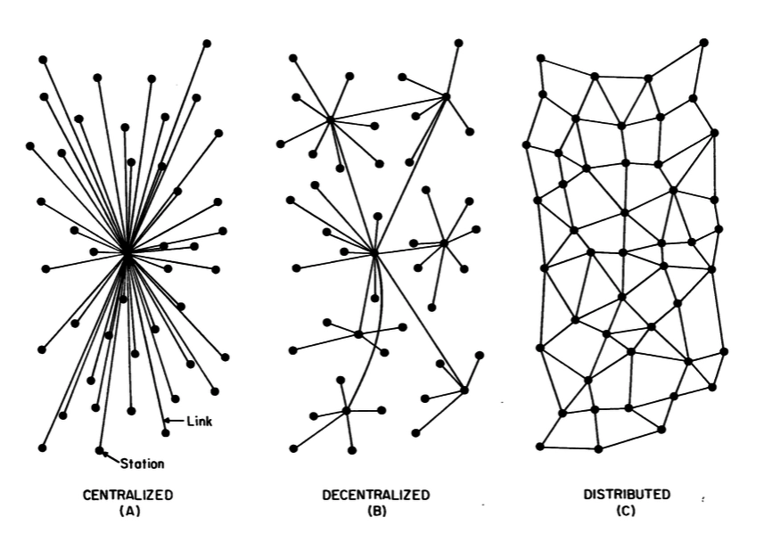

# Distributed networks

tags: epistemology, topology, complexity, knowledge, p2p, networks, distributed, concepts

## Visual explanation

> *Baran, P. (1964). On Distributed Communications, Memorandum RM-3420-PR.*

## Description

We can say that a network has a **distributed** topology if all its nodes could be connected without intermediates, exchanging information freely without central control.

Distributed networks are different from centralized networks, those with a centralized topology on one node. 

They are also different from decentralized or federated networks, those with several central nodes connected to each other.

The distributed topology was created by Paul Baran (1969) as an attempt to protect American communications during the Cold War. His idea was used to design a resilient communication system, able to guarantee the connectivity between different nodes under the risk of nuclear attacks.

Since then, the idea of a gradual decentralization of social and communication structures has been taken by different scholars and communities for its advantages for resilience. 

However, as I analyzed in the article ["Distributed Networks and Pandemics"](../articles/pandemics.md), distributed networks are vulnerable to biological wars, viral outbreaks, disinformation and fake news.

## Contextualization: P2P and distributed networks

Frequently, when someone reads the term *P2P*, concepts like cracking or copyright appear. The reason of this association is the popularity of a set of software programs which, by using peer-to-peer protocols, allow users to exchange media files without central nodes. 

However, the concept which is behind this acronym is deeper and implies a change of paradigm with very important implications in a wide variety of fields such as economics, politics, science or education.

Michel Bauwens defines the term P2P as the relational dynamic of distributed networks. 

Part of my former research analyzed human societies from the perspective of information processing and agent-based modeling. My doctoral thesis described the impact of the P2P paradigm in the collective production of knowledge, justifying theoretically and computationally how the minimization of strategic homogeneity, as much as the maximization of the decentralization of communication structures, imply a higher emergence of collective intelligence and self-organization. 

This paradigm, both relational and attributive, would be linked to **peer-to-peer social dynamics**, and also to new models for knowledge production, the increase of open access sources and the *commons-based peer production* approach.