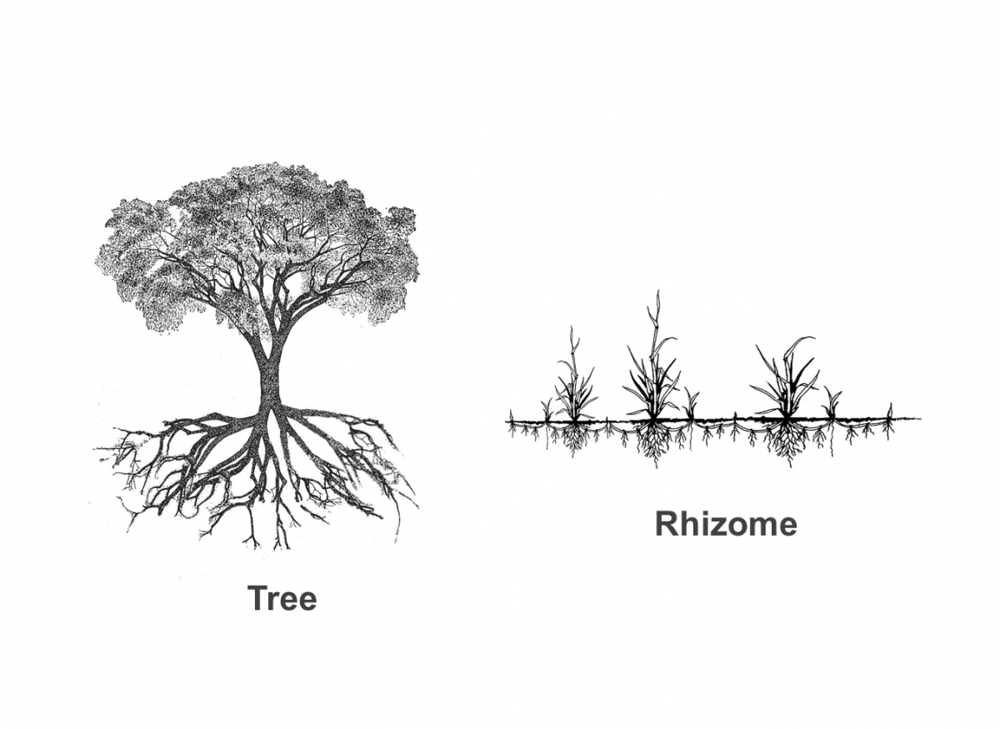

# Rhizome

tags: epistemology, topology, complexity, knowledge, rhizome,  concepts

## Visual representation

> Source of the image: ["The Rhizome" - an American Translation](https://www.themantle.com/philosophy/rhizome-american-translation)

## Description

> Deleuze and Guattari use the terms "rhizome" and "rhizomatic" to describe theory and research that allows for multiple, non-hierarchical entry and exit points in data representation and interpretation. In A Thousand Plateaus, they oppose it to an arborescent (hierarchic, tree-like) conception of knowledge, which works with dualist categories and binary choices. [See source](https://en.wikipedia.org/wiki/Rhizome_(philosophy))

> As a model for culture, the rhizome resists the organizational structure of the root-tree system [...] Rather than narrativize history and culture, the rhizome presents history and culture as a map or wide array of attractions and influences with no specific origin or genesis [...] a rhizome has no beginning or end [...] The planar movement of the rhizome resists chronology and organization, instead favoring a nomadic system of growth and propagation. 

## Mathematical model: the graph

> In mathematics, graph theory is the study of graphs, which are mathematical structures used to model pairwise relations between objects. A graph in this context is made up of vertices (also called nodes or points) which are connected by edges (also called links or lines). [See source](https://en.wikipedia.org/wiki/Graph_theory)

As described [here](https://books.google.fr/books?id=vaXv_yhefG8C), a graph is a pair `G = (V, E)` in which:

   *  `V` a set of vertices (also called nodes)
   * `E ⊆ {x, y} | (x, y) ∈ V2 ∧ x ≠ y` a set of edges (also called links), which are unordered pairs of vertices.

## Knowledge Organization

This wiki represents a set of files (ideas, concepts, projects, notes...) connected to each other by links. It is structured as a rhizome and embodies a [subjective ontology](subjective_ontology.md) and a [rhizomatic epistemology](rhizomatic_epistemology.md)

