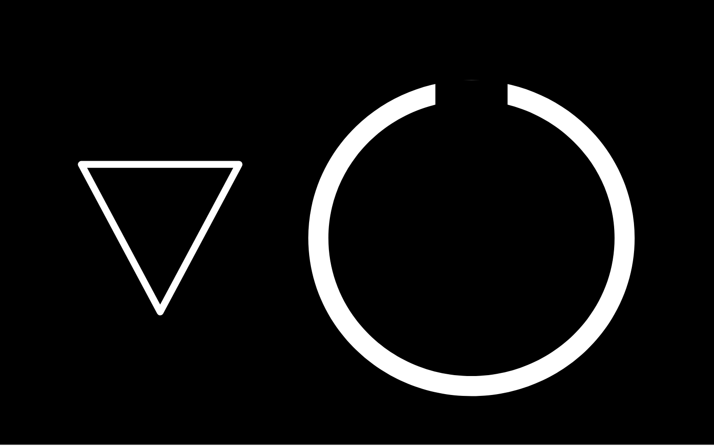

# Imaginary worlds

tags: imaginary-world, fiction, art, philosophy, mind

<tree>

    code1[1357];
    code2[123b5#7];
    world0((W-000));
    world1((W-001));
    world2((W-002));
    
    world0 . code1;
    code1 . world1;
    world0 . code2;
    code2 . world2;

</tree>

## Context 

> Imaginary worlds are cognitive gates towards our true phenomenological potential. They let us explore the nature of subjective ontologies in a virtual universe without the need of any correspondence with our objective reality. They truly become actual worlds in the experience of the thinker, the observer, the reader, the creator. 

> These narrative experiments constitute the starting point of a variety of unfolding ontologies, of distinct and parallel universes full of creative and philosophical possibilities.

> This fictional narrative is mainly text-based but it is inevitably interwoven with visual artwork, music, coding, and constructed language explorations. It is transversal to other artistic and philosophical projects.

## Axioms 

* The living creatures of this ontology are called `seins`. They can have `atention` tokens or `noise` tokens (see **figure 1** ). `seins` are biological entities that use `atention` to survive. They also struggle in situations in which `attention` is scarce and `noise` levels are high.

* `outers` are `attention` predators. They can be biological entities, objects, processes o artificial systems. They extract energy from `seins`, by using entertainment or manipulation techniques to distract them, transforming their `attention` tokens into `noise` tokens. 

* There are three overlapped worlds (see **figure 2** ). `Phej` is a theory and praxis that can enable `seins` to navigate these worlds.

* If `seins` get enough `attention` tokens and practice `Phej`, they can travel between worlds (see **figure 3** ). However, most `seins` are saturated by `noise` or controlled by the `outers`. Therefore, most `seins` are constrained to an existence in `{ World-000 }`. 

## Narrative

### { World-000 }

`{ World-000 }` is a physical reality governed by the rules of physics.

`Vraj` is a biological entity, a `sein`, an inhabitant of `{ World-000 }`. 

In this world, `Vraj` manifests itself through a bipedal morphology with a performative nature, characterized by a set of physiological and psychological needs and different layers of self-organized molecular, cellular and neural aggregates. 

`Vraj` is embodied in `{ World-000 }` through an organic character, through a viscous, tangible and dynamic avatar.  As a biological and social entity, `Vraj`'s organic substrate is projected in the social playground through context-based behavior.

`Vraj` learns about the `{ World-000 }` like any other `sein`, through a sequential and vivid stream of sensory stimuli, nociception, emotions and episodic memories.

`Vraj` adapts to a given environment through interactions with objects and other beings, experiencing feelings, playing social roles and using natural languages for communication. It takes advantage of the motor, cognitive and perceptual advantages of its species; but as any other `sein` it can be misguided by cognitive biases and evolutionary vestiges, encoded by evolution and education in its genome and neural networks.  

Long time ago, `Vraj` decided to become a traveler between worlds. After a series of lucky events, as a consequence of its perseverance and a long training process, `Vraj` increased its `attention` tokens and discovered `Phej`, the science behind the understanding of `{ World-001 }` and `{ World-002 }`.

In `{ World-000 }` nobody knows the whole individuality that `Vraj` embodies, but just the visual side of this organic character, the projection, the performative avatar. However, `Vraj` represents the pure cognitive potential of any `sein` with proper training and intention.

`Vraj` takes care of others `seins` and invest its life like any other `sein`, surviving, performing, working, interacting. 

However, `Vraj` also invests time in keeping its powers safe, preserving its `attention` tokens, practicing and studying the nature of `Phej`. As any `sein`, it requires its own needs and temporary preferences to be satisfied. However, `Vraj` should also skip cognitive biases, substituting fake narratives by alternative thoughts when exaggerated emotions are detected. `Vraj` analyzes perceptual inputs and redirects synaptic signals based on a complex process based on phenomenological training and self-awareness. Otherwise `Vraj` would fail and would be captured by the `outers`, its only enemies, which predate `seins`'s `attention` tokens and hinder the practice of `Phej`.

`Vraj` applies all the knowledge from `{ World-001 }` and `{ World-002 }` in its interactions with others. It also tries to transform the physical and social environment of  `{ World-000 }` according to its inner values and the experience of `Phej`.

This schematic description describes some of the cognitive triggers that encode the portals between worlds, worlds that `Vraj`, as a practitioner of `Phej`, can easily navigate:

<world><treeview></treview></world>

### { World-001 }

`{ World-001 }` is a phenomenological reality. Every object is just an experienced phenomenon and every action only takes place in the mind of the `sein` that experiences the world. 

Therefore, `Vraj` is the only perceptor in `{ World-001 }`, and its mainly task is to explore the world while keeping the balance of the perceptual reality, trying to compensate the natural emergence of chaos and the dominance of `noise` over `attention`.

In `{ World-001 }`, `Vraj` does not require any natural language for communication purposes considering that there is nobody else to communicate with. It rather uses its own personal conlang as an artistic and phenomenological investigation.

`Vraj` is a pseudo-monk with specific monastic-like vows, a devoted practitioner of `Phej`, a non-dogmatic tradition oriented to the deconstruction of our default perception and the emergence of a subjective realm. 

`{ World-001 }` is therefore a byproduct of `Phej` that takes place in `Vraj`'s mind, and it can only be understood and properly described by `Vraj`. This text is just a profane attempt to express it from an outsider perspective. Further descriptions of this world would be just expressed as `Vraj` wrote about them, in its own language, with its own script and philosophy.

`Vraj` is in charge of keeping the `outers` out of `{ World-001 }`, focusing on controlling its awareness, keeping safe its `attention` token.

Through the practice of `Phej`, `{ World-001 }` unfolds and `Vraj` browses an open-ended perceptual realm.

Since it embraced this pseudo-monastic life, `Vraj` performs a continuous process of rearrangement, keeping things in order day after day, while discovering new colors, shapes, possibilities. 

In `{ World-001 }`, `Vraj` lives a minimal life dedicated to preserve its `attention` tokens, controlling `{ World-001 }` and studying `Phej`. Keeping the world in equilibrium, like a postmodern Sisyphus surrounded by minimal techno.

### { World-002 } 

`{ World-002 }` is an empty reality.

`Vraj`, through the practice of `Phej`, also has the possibility of traveling to `{ World-002 }`.
However, once in `{ World-002 }`,  `Vraj` dilutes and becomes a subtle presence.

In `{ World-002 }` there are neither physical neither phenomenological objects. There is only nothingness (`tze`).

At the beginning of any trip to `{ World-002 }`, `Vraj` starts perceiving `tze` in a very subtle way, while ` {World-001} `  and ` {World-002} ` interferences take place, like green clouds on a black sky.

Through practice and preserving, `Vraj` ignores the green clouds and then, eventually, the timeless perception of `tze` takes place.

Darkness. Nothingness. Not being.

