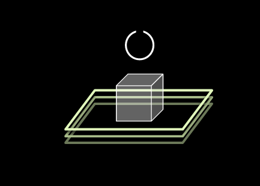

# Imaginary worlds

tags: imaginary-world, fiction, philosophy, mind

<tree>

    code1[1357];
    code2[123b5#7];
    world0((W-000));
    world1((W-001));
    world2((W-002));
    
    world0 . code1;
    code1 . world1;
    world0 . code2;
    code2 . world2;

</tree>

## Context 

> Imaginary worlds are cognitive gates towards our true phenomenological potential. They let us explore the nature of subjective ontologies in a virtual universe without the need of any correspondence with our objective reality. They truly become actual worlds in the experience of the thinker, the observer, the reader, the creator. 

> These narrative experiments constitute the starting point of a variety of unfolding ontologies, of distinct and parallel universes full of creative and philosophical possibilities.

> My synthetic multiverse is mainly text-based but it is inevitably interwoven with visual artwork, music, coding, and constructed language explorations. 

## Introduction 

###  Axioms

* There are two species: `vrajs` and `outers` (see **figure 1** ).

* There are three worlds (see **figure 2** ).

* `vrajs` are biological entities. They use `atention` to survive and struggle in situations in which `attention` is scarce or wasted on distractions.

* `outers` are `attention` predators. They extract energy from `vrajs`, by using manipulation techniques to steal their `attention`. 

* Only `vrajs`, using their `attention` token, can travel between worlds (see **figure 3** ). However, `outers` are constrained to `{ World-001 }`. 

* `outers` can mutate in `vrajs` if they start using their `attention` rather than taking others'.

* `vrajs` can mutate in `outers` if they forget to use their `attention` and start stealing others' `attention`.

### Subject

This narrative is about `Vraj`, an entity which belongs to the animal realm of the `vrajs`.

## A three-layers multiverse

### { World-000 }

`Vraj` is a biological entity, an inhabitant of `{ World-000 }`. 

In this world, `Vraj` manifests itself through a bipedal morphology with a performative nature, characterized by a set of physiological and psychological needs and different layers of self-organized molecular, cellular and neural aggregates. 

`Vraj` is embodied in `{ World-000 }` through an organic character, through a viscous, tangible and dynamic avatar.  As a biological and social entity, `Vraj`'s organic substrate is projected in the social playground through context-based behavior.

`Vraj`learns about the `{ World-000 }` through a sequential and vivid stream of sensory stimuli, nociception, emotions and episodic memories.

`Vraj` adapts to a given environment through interactions with objects and other beings, playing social roles and using natural languages for communication, enjoying the motor, cognitive and perceptual advantages of its species; but also misguided by cognitive biases and evolutionary vestiges that are encoded in its genome and neural networks. 

In this world, nobody knows the whole individuality that `Vraj` embodies, but just the visual side of this organic character, this projection, this performative avatar. `Vraj` should take care of others `vrajs`, but only if its own needs and temporary preferences are satisfied. Otherwise `Vraj` would fail and would be captured by the `Outers`, their biggest enemies, which predate `vraj`'s attention.

However, `Vraj` knows how to navigate different worlds and how to open the portals between them. 

`Vraj` applies all the knowledge from `{ World-001 }` and `{ World-002 }` in its interactions with others and tries to transform the physical environment of  `{ World-000 }` according to its inner values.

This schematic description describes some of the cognitive triggers that encode the portals between worlds that `Vraj` knows.

<world><treeview></treview></world>

### { World-001 }

`Vraj` is the only perceptor in `{ World-001 }`, and its mainly task is to keep the balance of the perceptual reality, trying to compensate the natural emergence of chaos and the dominance of `Noise` over `Music`.

It is also in charge of keeping the `Outers` out of `{ World-001 }`, focusing on controlling its awareness, keeping safe its `attention` token .

Its main skill is to skip cognitive biases, substituting fake narratives by alternative thoughts when exaggerated emotions are detected. `Vraj` analyzes perceptual inputs and redirects synaptic signals based on a complex process based on phenomenological training and self-awareness. 

Since it embraced monastic life, `Vraj` performs a continuous process of rearrangement, keeping things in order day after day. It keeps  `{ World-001 }` in equilibrium, like a postmodern Sisyphus, but surrounded by minimal techno, post-rock and the possibility of traveling to `{ World-002 }` when the `Circle` is open.

It lives a minimal life dedicated to preserve its `atention` token, controlling `{ World-001 }` and studying `tze`.

### { World-002 } 

* There is nothingness (`tze`)
* `Vraj` is perceiving that nothingness
* ` {World-001} `  and ` {World-002} ` interferences take place, like green clouds on a black sky.
* `Vraj` ignores the green clouds.
* Timeless perception of `tze`.
* Darkness. Nothingness.

