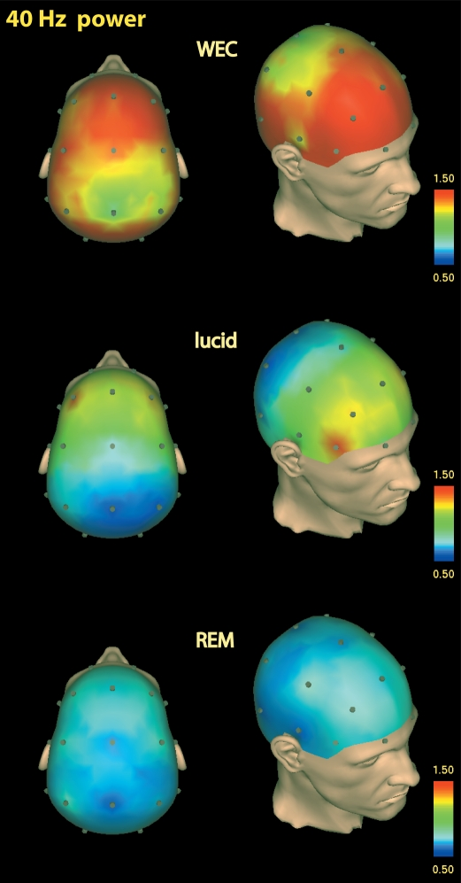
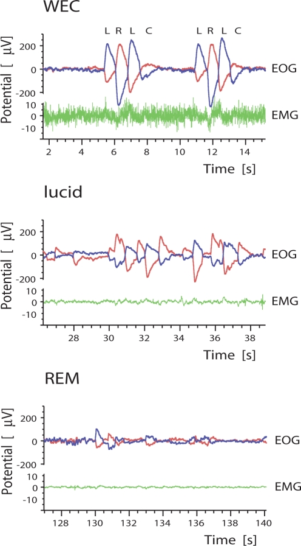
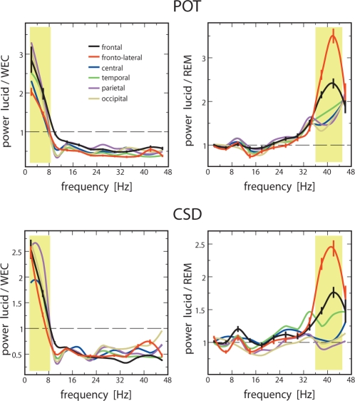
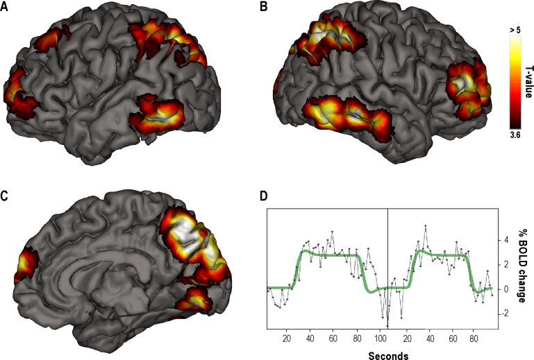
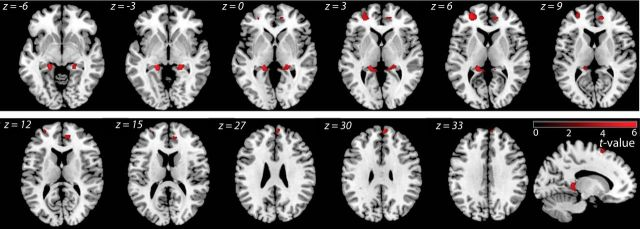

# Lucid Dreaming

tags: eeg, lucid-dreaming, notes, neuroscience, cognitive science, phenomenology, neurophenomenology, erp, research

## Neuroscience research

## Introduction

The first scientific proof of lucid dreaming took place in 1981, thanks to study in **Stanford University** in which subjects sent a previously defined eye-movement signal while lucid dreaming. In the study they used *electrooculography (EOG)*, *electromyography (EMG)* and [electroencephalography (EEG)](eeg-notes.md). The reference to this study is <cite>Sleep, D. R. E. M., Laberge, S. P., Nagel, L. E., Dement, W. C., & Zarcone, A. N. D. V. P. (1981). Lucid dreaming verified. Perceptual and Motor Skills, 52, 727–732. https://www.ncbi.nlm.nih.gov/pubmed/24171230</cite>.

In 2009, Voss et al. (<cite>Sleep. 2009 Sep; 32(9):1191-200. Lucid dreaming: a state of consciousness with features of both waking and non-lucid dreaming. Voss U., Holzmann R., Tuin I., Hobson JA. https://www.ncbi.nlm.nih.gov/pubmed/19750924</cite>) observed a higher activity in the frontal lobes during this state, something that would explain the role of metacognition and self-reflection in lucid dreaming: 

> Results show lucid dreaming to have REM-like power in frequency bands delta and theta, and higher-than-REM activity in the gamma band, the between-states-difference peaking around 40 Hz. Power in the 40 Hz band is strongest in the frontal and frontolateral region. Overall coherence levels are similar in waking and lucid dreaming and significantly higher than in REM sleep, throughout the entire frequency spectrum analyzed. Regarding specific frequency bands, waking is characterized by high coherence in alpha, and lucid dreaming by increased delta and theta band coherence. In lucid dreaming, coherence is largest in frontolateral and frontal areas.

They concluded that their data showed "that lucid dreaming constitutes a hybrid state of consciousness with definable and measurable differences from waking and from REM sleep, particularly in frontal areas.".

The spacial resolution still was not as accurate as with FMRI, but a study in 2012 offered some neural correlates with a higher level of detail, observing that “during lucid dreaming the bilateral precuneus, cuneus, parietal lobules, and prefrontal and occipito-temporal cortices activated strongly as compared with non-lucid REM sleep". See <cite>Dresler, M., Wehrle, R., Spoormaker, V. I., Koch, S. P., Holsboer, F., Steiger, A., Obrig, H., Sämann, P. G., & Czisch, M. (2012). Neural Correlates of Dream Lucidity Obtained from Contrasting Lucid versus Non-Lucid REM Sleep: A Combined EEG/fMRI Case Study. Sleep, 35(7), 1017–1020. https://doi.org/10.5665/sleep.1974</cite>.

Some images from both studies are shown below:

   

# The role of meta-cognition

It seems intuitive that meta-cognition has a direct effect on lucid dreaming. Actually, lucid dreaming can emerge as an artifact or epiphenomenon if meta-cognition is trained. Performing phenomenology on a daily basis, and developing routines involved in self-reflection, could lead to lucid dreaming.

Some evidence is provided in studies like <cite>Filevich, E., Dresler, M., Brick, T. R., & Kühn, S. (2015). Metacognitive mechanisms underlying lucid dreaming. Journal of Neuroscience, 35(3), 1082–1088. https://doi.org/10.1523/JNEUROSCI.3342-14.2015</cite>, where they compared the *voxel-based morphometry (VBM)* differences between the two lucidity groups based on brain imaging. The "high-lucidity group showed greater gray matter volume in two separate clusters within BA9/10, in right ACC, left SMA and hippocampus bilaterally." 

 