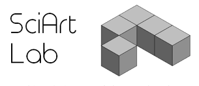

# My projects

tags: projects, tech, software engineer, art, photography

## SciArt Lab

Most of my Research & Development and Open Source coding projects can be found in the [projects section](https://filedn.com/lzKR35HlP1yHLFtV0oLTAku/wiki/sciartlab.html#!content/projects/sciartlab.md) of the [SciArt Lab](http://sciartlab.com) website.

## Research and Development / Software Engineering

To see my professional projects as **Software Engineer** under different brands and companies you can check my [LinkedIn account](http://es.linkedin.com/in/xmunch/en). 

## Personal projects

### Photography

Photography is my main artistic tool. Considering the growing amount of artistic projects I have been working on during the last years, I've created a [specific page](projects/photography.md) for a selection of them.

### Video / Documentary

#### Latest

##### - [Looking for Identity](https://youtu.be/1rUHNIJ7rn0) (English)

> Visual ethnography with a film-making approach to explore multiculturalism and individual/social identity in the context of the U.S.A.

This movie was a project I develop some years ago while living in America. It talks about the American identity from a multicultural point of view. 

Some controversial issues are exposed, presenting a nation with a heterogeneous society, a complex and evolving multi-ethnic identity and a conflict of cultural forces and discourses.

In the moment of historic change in which this has been filmed (2016-2017), the U.S.A. faces a moment of transformation and tensions between a national identity and a large number of racial, ethnic, religious or linguistic identities, between assimilation and intercultural engagement.

#### Older

My former hand-held camera documentaries are both in Spanish.

The quality of the final products is not very good, considering that the resources that I had at that time were so much limited. No DSLR, no lenses, no microphone, no tripod, no plan. Just a hand-held HD camera, a laptop for post-production and a hard story.  But I consider both of them two unique visual ethnographies to understand better two very different realities.

##### - [Japikuna](https://www.dailymotion.com/video/xavsje) (Spanish) 

Documentary about the impact of Cooperation of Development in indigenous communities and marginalized children in Bolivia.

##### - [Éxodo](https://www.youtube.com/watch?v=K5TywvMddog) (Spanish)

Documentary about the risks of illegal immigration in Africa. Filmed in Senegal.
