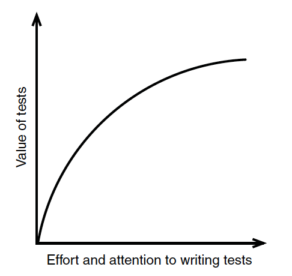
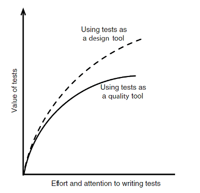
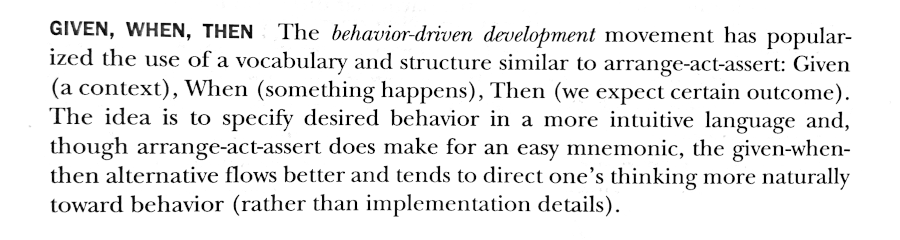

## Effective Unit Testing
A book by Lasse Koskela
A review by Diego González 😉


---

# Jargon

SUT -> System Under Test
GOD -> Martin Fowler

---


The promise of good tests 
<br>


---
<!-- 
_class : invert
-->

Tests improve productivity

<br>

  

---

<!-- 
_class : invert
-->

Tests decrease the amount of future bugs
<br>

<br>
[They watch the code for you]

---
<!-- 
_backgroundColor: white
-->


> The more tests we have,
the less value an additional test is likely
to yield.

---

<!-- 
_backgroundColor: white
-->





> The biggest value of writing a test lies not in the resulting  test but in what we learn from writing it.
---

<!-- 
_class : invert
-->
# Cool! So...

 The point is that we can (and should) use tests as a **design tool**
 <br>


---


> BDD **Mantra**

Check for behavior. Not implementation 
<br>


---

> 


---


```
import spock.lang.Specification

class DocuTeamSpec extends Specification {

    def "it should verify the number of hands of our team"() {
        
		given: "Docuten has 9 people in the IT team"
		    
                    def i = 9

		when: "Each member has 2 hands"

		    i = i * 2

		then: "The expected number of hands to code is 18"
    
                    assert i == 18
	}
}
```
---


<!-- 
_class : invert
-->

 ### Test Doubles

<br>

  

---

# Taxonomy of test doubles

* Test Stub
* Fake Object
* Test Spy
* Mock Object


---

# Test Stub
Test stubs are unusually short things

  ```
  public class LoggerStub implements Logger { 
	public void log(LogLevel level, String message) { 
		//Do nothing
	} 
}
```
---

# Fake Object

Fake objects do it without side effects

  ```
  public class FakeUserRepository implements UserRepository { 

	  private Collection<User> users = new ArrayList<User>();

	  public void save(User user) { 
		  if (findById(user.getId()) == null)  users.add(user);
	  }

	  public User findById(long id) { 		
		for (User user : users) { 
		   if (user.getId() == id) return user;
		}
		return null; 
	} 
}
```
---
# Test Spies
These guys steal your secrets


  ```
  public void filter(List<?> list, Predicate<?> predicate) { ... }

  // How can I test this method if none of the objects can
  // reveal what happens inside?
  
```

**Override an internal method and verify what it does**

---

### Almost mocks?

> In short, test spies are test doubles built to record what’s happening with them so that the test will know afterward what happened. Sometimes we take this concept farther and **our test spies become full-blown mock objects.**
---

<!-- 
_class : invert
-->
## Kind of...


> If test spies are like undercover cops, then mock objects are like having a remote-controlled cyborg infiltrate the mob.


---

Jumping out of the book...


Let's ask God, aka Martin Fowler :)

---

<!-- 
_class : invert
-->
> Mocks are what we are talking about here: objects pre-programmed with expectations which form a specification of the calls they are expected to receive.

<br>

http://martinfowler.com/articles/mocksArentStubs.html


---

<!-- 
_class : invert
-->

> Only mocks insist upon **behavior verification**. The other doubles can, and usually do, use **state verification** [...] mocks differ in the setup and the verification phases.


<br>

http://martinfowler.com/articles/mocksArentStubs.html

---

Basically, the idea is that Mocks's methods are not modified, but rather just verified. We are interested in **behavior verification**.

---

Using an example in Spock:

```

given:

 	def invoice = Mock(EditionInvoice)

when:

 	invoice.send()

then:

 	1 * invoice.doAfterSending()
 	1 * invoice.notifyReceptor()

```
---

<!-- 
_class : invert
-->
Another interesting resource to understand mocks:

<br>

https://medium.com/@xala3pa/mocking-with-spock-51c8e2fb6cb6

---


# Catalog

---

* Readability
* Maintainability
* Trustworthiness

---

<!-- 
_class : invert
-->

**Bonus Mantra I**

> Inject your dependencies 
<br>


---

<!-- 
_class : invert
-->

**Bonus Mantra II**

> Avoid Thread.sleep (time matters!)  
<br>


---

<!-- 
_class : invert
-->

**Bonus Mantra III**

> A test should have only one reason to fail
<br>


---


Images from https://freeiconshop.com and the aforementioned book :)
<br>
**Cheers and thanks, Docuteam!**

<br>


---

Permalink: http://talks.xmunch.com/testing-notes