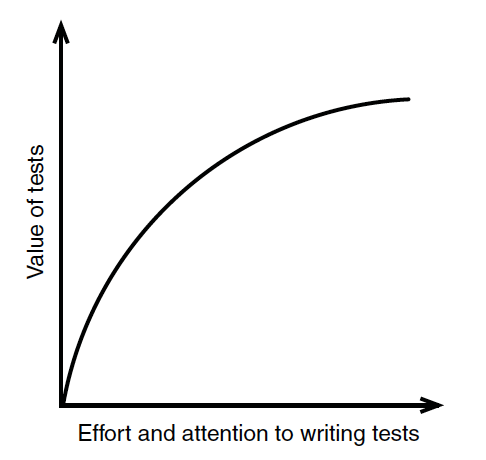
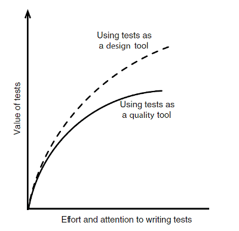
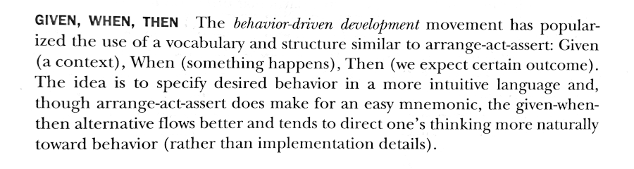

## Effective Unit Testing
A book by Lasse Koskela
A review by Diego González 😉


---


The promise of good tests 
<br>


---
<!-- 
_class : invert
-->

Tests improve productivity

<br>

  

---

<!-- 
_class : invert
-->

Tests decrease the amount of future bugs
<br>

<br>
[They watch the code for you]

---
<!-- 
_backgroundColor: white
-->


> The more tests we have,
the less value an additional test is likely
to yield.

---

<!-- 
_backgroundColor: white
-->





> The biggest value of writing a test lies not in the resulting  test but in what we learn from writing it.
---

<!-- 
_class : invert
-->
# Cool! So...

 The point is that we can (and should) use tests as a **design tool**
 <br>


---


> BDD **Mantra**

Check for behavior. Not implementation 
<br>


---

> 


---


```
import spock.lang.Specification

class DocuTeamSpec extends Specification {

    def "it should verify the number of hands of our team"() {
        
		given: "Docuten has 9 people in the IT team"
		    
                    def i = 9

		when: "Each member has 2 hands"

		    i = i * 2

		then: "The expected number of hands to code is 18"
    
                    assert i == 18
	}
}
```
---


<!-- 
_class : invert
-->

 ### Test Doubles

<br>

  

---

* Test doubles
	* Test stub
	* Fake object
	* Test spy
	* Mock object


---

<!-- 
_class : invert
-->


> Inject your dependencies


---

Images from https://freeiconshop.com and the aforementioned book :)