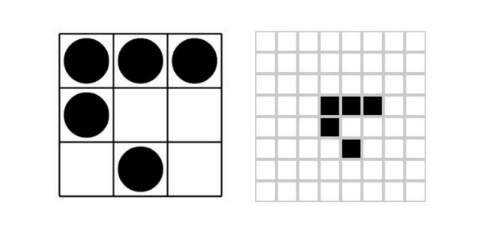
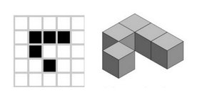

# About

## Introduction to the SciArt Lab

**We are a Research and Development Lab for the open exploration of Science, Art and Technology**

* We create open source prototypes, code and ideas to promote STEAM education. 
* We help future hackers to understand the world with DIY experiments. 
* We promote Science, Art and Technology as emancipatory tools. 
* We follow unconventional research approaches to hack seemingly unrelated topics such as virtual reality, cognitive science, artificial intelligence, music, biology, chemistry or digital art. 
* We foster multidisciplinary knowledge and technology-driven creativity, essential cognitive tools for a new generation of critical thinkers and young DIY researchers.
* We enable unconventional DIY research and creative explorations in innovative and unusual ways, hacking traditional ontological and epistemological constraints, building bridges beyond the limits imposed by a specific academic field. Discovering new methods to teach science, understanding the inner nature of social agents, playing with artificial intelligence models, composing music with genetic algorithms, simulating complex adaptive systems, exploring cognitive science with artistic representations or experimenting with new techniques for visual expression through digital photography or virtual reality.

## Our logo

When somebody looks to the SciArt Lab logo, usually only sees five cubes without any known meaning. Some others visualize an inverted “L” and an extra shape in 3D. The origin of the logo, however, ​is ​rooted ​in ​the ​hacker ​ideals, ​represented ​by ​the *​glider* ​shape.

The *glider* is a bidimensional pattern which moves across a grid in a cellular automaton known as the  *Game of life*. For those who are experts in Computer Science, Math or Evolutionary Algorithms this can sound familiar. For those who don’t know what we are talking about, let’s say that it has a meaningful symbolic power in the context of the hacker culture, but also that it represents the potential of simple rules leading to the emergence of dynamic and complex patterns.

The ​logo ​of ​the ​SciArt ​Lab ​is ​simply ​a ​new ​perspective ​regarding ​the ​same ​concept. ​Simple ​cells whose ​local ​positions ​affect ​the ​global ​configuration. ​Bottom-up ​knowledge ​production ​based on ​simple ​local ​interactions ​and ​hands-on ​learning.

## Our team

### Founders

#### DIEGO GONZALEZ, PHD

Multidisciplinary researcher, software engineer, visual ethnographer, DIY nerd and digital artist.

You can read his [personal wiki](http://wiki.xmunch.com) to discover part of the theoretical background of the organization. Actually, you will find there [random notes related with the lab](http://wiki.xmunch.com/#!tags/sciart.md).

For more information [visit his personal site](http://www.xmunch.com/).

#### PAULA MORALES, PHD

Computational chemist, Medicinal Chemistry researcher, science advocate.

[Read more](https://orcid.org/0000-0002-6209-8600)

### Advisors and Collaborators

#### VASILIS KOSTAKIS, PHD

Faculty Associate at Harvard University, Professor of P2P Governance at Tallinn University of Technology and the founder of the P2P Lab.

[Read more](https://scholar.google.com/citations?user=GhIZ-iEAAAAJ&hl=en)
 

#### MATT RATTO, PHD

Associate Professor in the Faculty of Information at the University of Toronto, Director of the Bachelor of Information degree program, and the Bell University Labs Chair in Human-Computer Interaction. 

[Read more](https://ischool.utoronto.ca/profile/matt-ratto/)
 

#### FATIH OGUZ, PHD

Associate Professor of the LIS Department at the School of Education of the University of North Carolina at Greensboro. Open Information Advocate.

[Read more](https://soe.uncg.edu/directory/faculty-and-staff/bio-fatihoguz/)
 

#### SONIA DE CASTRO, PHD

Researcher at Medical Chemistry Institute of Spanish National Research Council (CSIC). Passionate DIY Science hacktivist.

[Read more](https://www.researchgate.net/profile/Sonia_De_castro)

