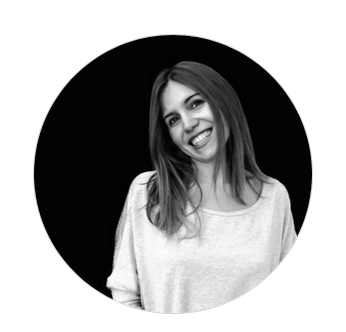
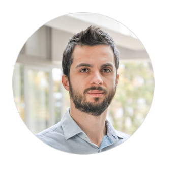
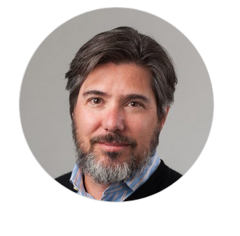
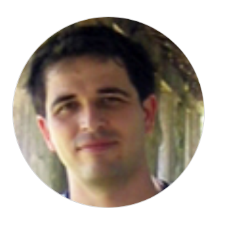
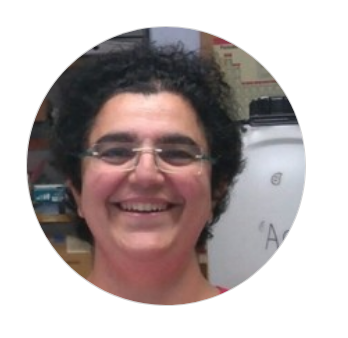

# Team

## Founders

### DIEGO GONZALEZ, PHD

 Software Engineer at Docuten. Multidisciplinary researcher. Digital artist and maker. DIY Neuroscience and Philosophy of Mind nerd. You can read his [personal wiki](http://wiki.xmunch.com) to discover part of the theoretical background of the organization. Actually, you will find there random notes related with the lab. For more information [visit his personal site](http://www.xmunch.com/) or his [personal summary](http://wiki.xmunch.com/#!about.md).

### PAULA MORALES, PHD

 Postdoctoral Researcher at  Medical Chemistry Institute of Spanish National Research Council (CSIC). Computational Chemist &  Science Advocate. [Read more](https://orcid.org/0000-0002-6209-8600)

## Advisors and Collaborators

### VASILIS KOSTAKIS, PHD

 Faculty Associate at Harvard University, Professor of P2P Governance at Tallinn University of Technology and the founder of the P2P Lab. [Read more](https://scholar.google.com/citations?user=GhIZ-iEAAAAJ&hl=en)
 

### MATT RATTO, PHD

 Associate Professor in the Faculty of Information at the University of Toronto, Director of the Bachelor of Information degree program, and the Bell University Labs Chair in Human-Computer Interaction. [Read more](https://ischool.utoronto.ca/profile/matt-ratto/)
 

### FATIH OGUZ, PHD

 Associate Professor of the LIS Department at the School of Education of the University of North Carolina at Greensboro. Open Information Advocate. [Read more](https://soe.uncg.edu/directory/faculty-and-staff/bio-fatihoguz/)
 

### SONIA DE CASTRO, PHD

 Researcher at Medical Chemistry Institute of Spanish National Research Council (CSIC). Passionate DIY Science hacktivist. [Read more](https://www.researchgate.net/profile/Sonia_De_castro)

